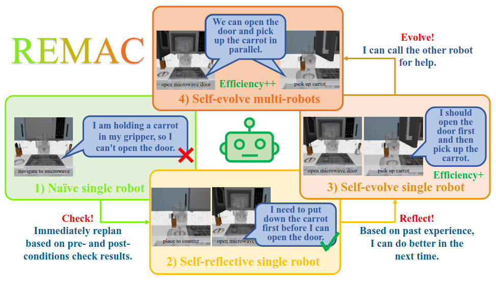
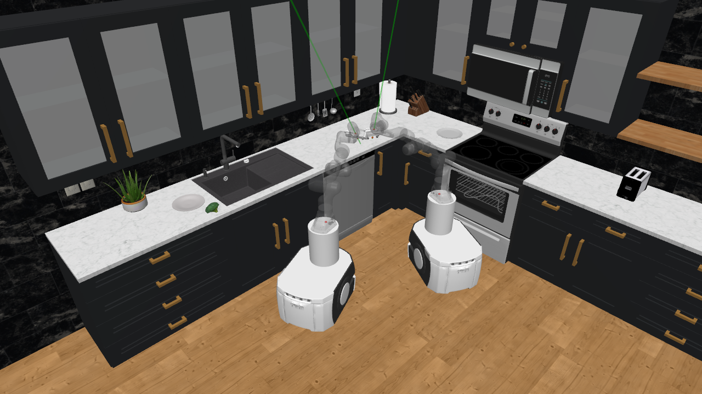
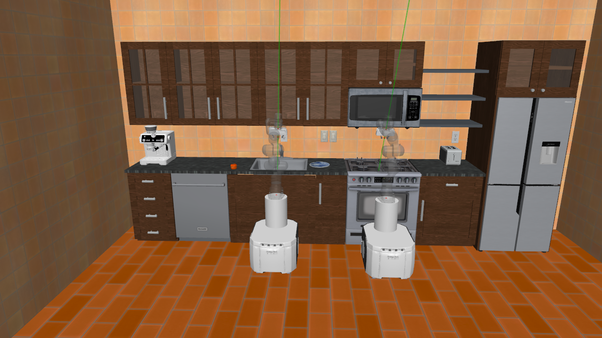
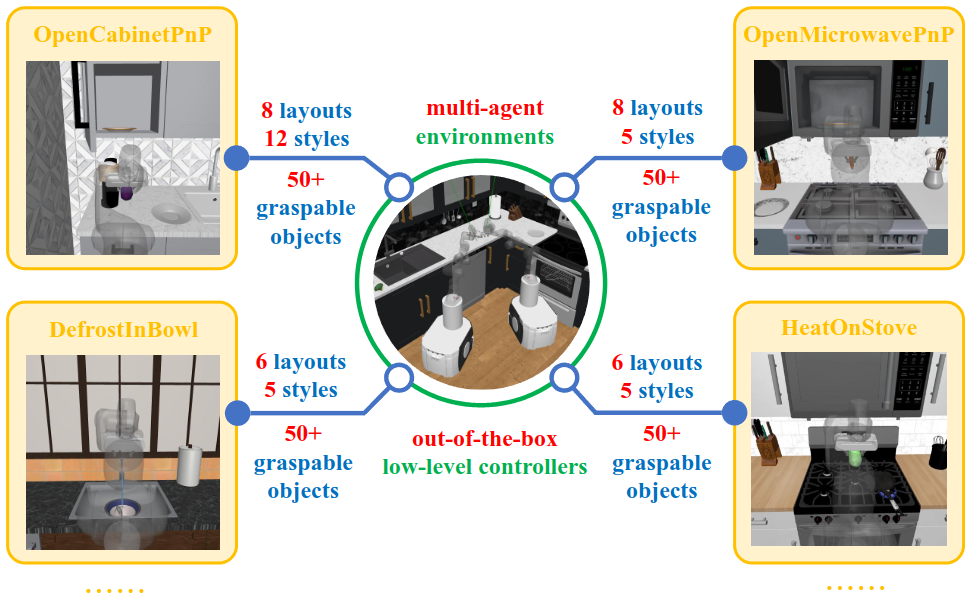
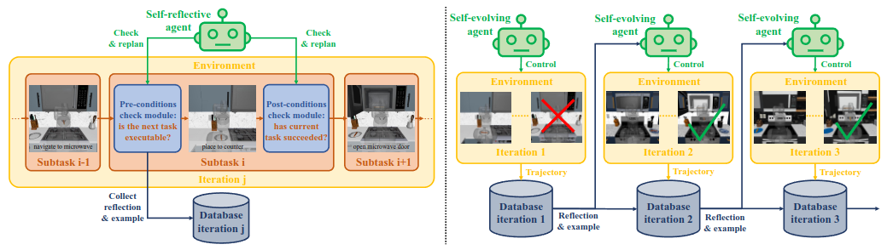
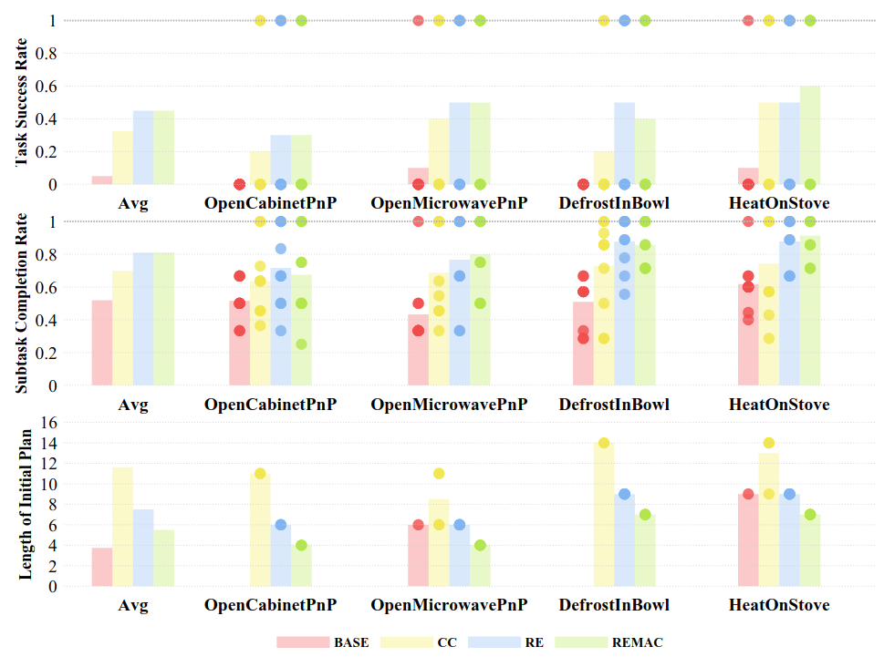

# REMAC: Self-Reflective and Self-Evolving Multi-Agent Collaboration for Long-Horizon Robot Manipulation



## Demo Video


https://github.com/user-attachments/assets/1bbb6144-e4e7-435a-a5a1-b6f36ba5f087


https://github.com/user-attachments/assets/ec5a73ea-b2fe-49a3-85ab-519683713d22


## Installation

1. set up conda environment, python 3.9 is recommended
```
conda create -c conda-forge -n robocasa python=3.9
conda activate robocasa
```   
2. install ```robosuite``` module in editable mode, branch：robocasa_v0.1
```
cd robosuite
pip install -e .
python robosuite/scripts/setup_macros.py
```
3. install ```robocasa``` module in editable mode, branch：main
```
cd robocasa
pip install -e .
conda install -c numba numba=0.56.4 -y
python robocasa/scripts/download_kitchen_assets.py
python robocasa/scripts/setup_macros.py
```
4. install ```robomimic``` module in editable mode, branch: robocasa
```
cd robomimic
pip install -e .
python robomimic/scripts/setup_macros.py # need to fill in private WANDB_API_KEY
pip install huggingface_hub=0.24.5
```
5. install latest ```openai``` module to support LLM and VLM settings
```
pip install openai
```

## Benchmark

Implement multirobot settings in robocasa.



### Tasks

We designed four tasks to evaluate the effectiveness of our method in kitchen scenarios, validated using the RoboCasa large-scale simulation framework



- OpenCabinetPnP: The task involves arranging the items into the cabinet. The robot should notice that the cabinet doors are originally closed and should be opened first before manipulating the items.
- OpenMicrowavePnP: The task involves heating the vegetables using a microwave. The robot should notice that the microwave door is originally closed, and should be opened first before manipulating the vegetable.
- DefrostInBowl: The task involves identifying all frozen fish or meat items on the counter and defrosting them in the sink. The robot should notice that a bowl is necessary to contain the meat and water in the sink.
- HeatOnStove: The task requires heating the vegetables on a stove. The robot should notice that a pan is necessary for containing the vegetables on the stove.

### Teleoperate

Teleoperate manually in this script. 
Use a keyboard to control and a mouse to adjust the rendering camera if the renderer is mjviewer (default).
Task includes single-task, multi-task, one-agent-task, two-agent-task. 
This script can also collect trajectories for imitation learning.
```
cd robocasa
python robocasa/demos/multi_teleop_test.py 
```

### Controller

Default PID planners for single-step tasks:
- Navigation
- Pick
- Place

The planners could be called automatically in the teleoperate script, facilitating possible task demonstration collection.

These planners are stored in `robocasa/robocasa/utils/planner`, which are also used in `robocasa/robocasa/utils/controller_dict.py` for language-guided robot control.

### Language Instruction Control

1. Using standardized language instructions to guide robot manipulation or navigation.
The input language command should match keys in `robocasa/robocasa/utils/controller_dict.py`, and will call either hardcode planner or checkpoint policy to control the robot.
```
python robomimic/robomimic/scripts/run_controlled_multitask_agent.py \
--env multitask_agent_env \
--renderer "mjviewer" # "mujoco" or "mjviewer"
```

2. Using standardized language instructions to guide two-robot manipulation or navigation.
The input language command should match keys in `robocasa/robocasa/utils/controller_dict.py`, and will call either hardcode planner or checkpoint policy to control the robot.
```
python robomimic/robomimic/scripts/run_controlled_multitask_twoagent.py \
--env multitask_twoagent_env # any registered env starts with "TwoAgent" \
--renderer "mjviewer" # "mujoco" or "mjviewer"
```

## Method



The figure above showcases our main pipeline.

### Left: Self-Reflection. 

Before the execution of subtask $i$, the VLM verifies the pre-conditions to determine whether the plan for subtask $i$ is executable given the observation after completing subtask $i-1$. If not, this indicates an error in the initial planning, and the system engages in a reflection process to identify the cause of this error, which is subsequently stored in the reflection database. Following the execution of subtask $i$, the VLM verifies the post-conditions to assess whether the subtask was successfully executed, given the observation after executing the current task. If not, the system initiates a retry of the subtask. 

### Right: Self-Evolvement

Upon sequential completion of all subtasks, the reflection database—containing accumulated pre-condition-check analysis and last-iteration plan serves as the foundation for generating initial plans for subsequent iterations. This knowledge-augmented process iteratively refines planning logic, yielding an optimized initial plan with feasibility and efficiency for future iterations.

## Experiment Scripts



### CC: High-level VLM Control with Condition Checking Mechanism

Call an agent to generate plans and commands to guide robot manipulation or navigation.
Based on the language instruction control script and settings above.
Use VLM to check whether post- and pre-conditions are satisfied after a single-step task is complete, if not, adjust the original plan.
```
python robomimic/robomimic/scripts/run_mix_multitask_agent.py \
--env multitask_agent_env \
--renderer "mjviewer" # "mujoco" or "mjviewer"
```

### RE: High-level VLM Control with Self-Reflection and Self-Evolvement

Call a reasoning agent to generate plans and commands to guide robot manipulation or navigation in a self-evolving manner.
Use VLM to check whether post- and pre-conditions are satisfied after a single-step task is complete, if not, adjust the original plan.
```
python robomimic/robomimic/scripts/run_mix_multitask_agent_reflective.py \
--env multitask_agent_env \
--renderer "mjviewer" # "mujoco" or "mjviewer"
```

### REMAC: High-level Multi-Agent Collaboration Based on Self-Reflection and Self-Evolvement

Based on past reflection and examples, call a reasoning agent to generate plans and commands to guide two robots' manipulation or navigation.
Use VLM to check whether post- and pre-conditions are satisfied after a single-step task is complete, if not, adjust the original plan.
```
python robomimic/robomimic/scripts/run_mix_multitask_twoagent.py \
--env multitask_twoagent_env \
--renderer "mjviewer" # "mujoco" or "mjviewer"
```
